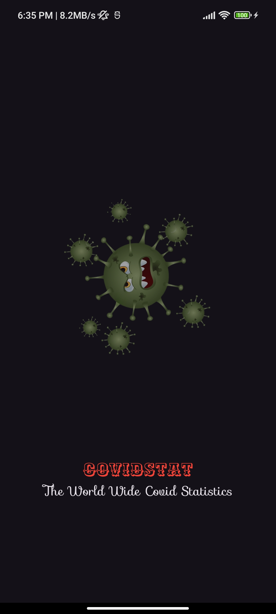

# Covid Stat - COVID-19 Tracker App

**Covid Stat** is a fully responsive COVID-19 tracker application built using **Flutter**. It fetches real-time global and country-specific COVID statistics through a REST API. The app provides users with a clean and interactive interface to view worldwide COVID stats, search by country, and explore detailed information.

## Features

- **Splash Screen**: An animated splash screen displayed on app startup.
- **Home Page**: Shows global COVID statistics with an interactive pie chart for data visualization.
- **Country Page**: Lists country-specific COVID details, with a search bar to filter countries by name.
- **Details Page**: Displays comprehensive COVID stats for the selected country.
- **Responsive UI**: The entire UI is fully responsive and works on different screen sizes.

## Screenshots

  
  &nbsp;&nbsp;&nbsp;&nbsp;&nbsp;&nbsp;&nbsp;&nbsp;
  
  &nbsp;&nbsp;&nbsp;&nbsp;&nbsp;&nbsp;&nbsp;&nbsp;
  
  &nbsp;&nbsp;&nbsp;&nbsp;&nbsp;&nbsp;&nbsp;&nbsp;
  

## Technologies Used

- **Flutter**: Cross-platform framework for building the mobile app.
- **Dart**: Programming language used in Flutter.
- **REST API**: Used to fetch real-time COVID statistics.
- **Charts Package**: For displaying the pie chart on the home page.
